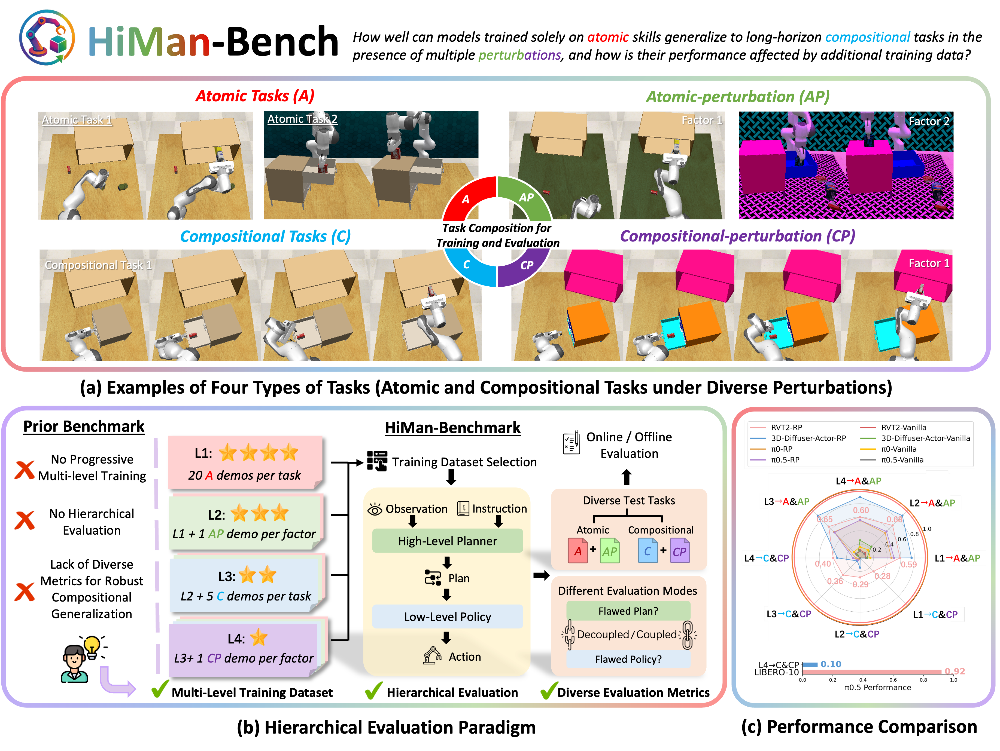

<p align="center">
  
</p>

<h1 align="center">🤖 RoboHiMan</h1>
<h3 align="center">A Hierarchical Evaluation Paradigm for Compositional Generalization in Long-Horizon Manipulation</h3>

<p align="center">
  <a href="https://robohiman.github.io/">🌐 Website</a> •
  <a href="#installation">🛠️ Installation</a> •
  <a href="#baselines">📊 Baselines</a> •
  <a href="#citation">🧾 Citation</a>
</p>

## 🧩 Overview

**RoboHiMan** is a **hierarchical evaluation paradigm** designed to study **compositional generalization** in **long-horizon manipulation**.  
It introduces **HiMan-Bench**, a benchmark consisting of **atomic** and **compositional tasks** under diverse perturbations, supported by a **multi-level training dataset** for analyzing progressive data scaling.

RoboHiMan further proposes hierarchical evaluation paradigms. The repository mainly provides three settings:

- **Vanilla** — model-only policy relying solely on the model's capabilities (no external planner).
- **Policy + rule-based planner** — a learned policy paired with a traditional rule-based planner for subgoal sequencing.
- **Policy + VLM-based planner** — a learned policy guided by a vision-language-model (VLM) planner for high-level planning and subgoal generation.  

These settings probe the necessity of **skill composition** and reveal **bottlenecks** in current hierarchical architectures.  
Experiments highlight clear capability gaps across representative models, pointing to future directions for advancing real-world long-horizon manipulation systems.


## 🛠️ Installation
See [INSTALL.md](INSTALL.md) for detailed setup instructions.

## 📊 Baselines

- [3D-Diffuser-Actor-Baseline](baselines/3d-Diffuser-Actor-Baseline/README.md)  
- [OpenPi-Baseline](baselines/OpenPi-Baseline/README.md)  
- [OpenPi05-Baseline](baselines/OpenPi05-Baseline/README.md)  
- [RVT-Baseline](baselines/RVT-Baseline/README.md)  

## 🧠 VLM-Based Planner
See [HIGH_LEVEL.md](INSTALL.md) for detailed setup instructions.

## 🧾 Citation

If you find this work useful, please consider citing:

```bibtex
@inproceedings{anonymous2025robohiman,
  title={RoboHiMan: A Hierarchical Evaluation Paradigm for Compositional Generalization in Long-Horizon Manipulation},
  author={Anonymous},
  booktitle={Under Review},
  year={2025}
}
```

## Acknowledgment
This project builds upon several excellent open-source efforts. We sincerely thank the authors of the following projects for their valuable contributions to the community:

- [**RVT**](https://github.com/nvlabs/rvt)
- [**3D-Diffuser-Actor**](https://github.com/nickgkan/3d_diffuser_actor)
- [**OpenPi**](https://github.com/Physical-Intelligence/openpi)
- [**LLaMA-Factory**](https://github.com/hiyouga/LLaMA-Factory)
- [**Colosseum**](https://github.com/robot-colosseum/robot-colosseum)
- [**DeCo**](https://deco226.github.io/)